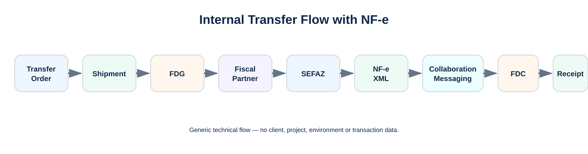
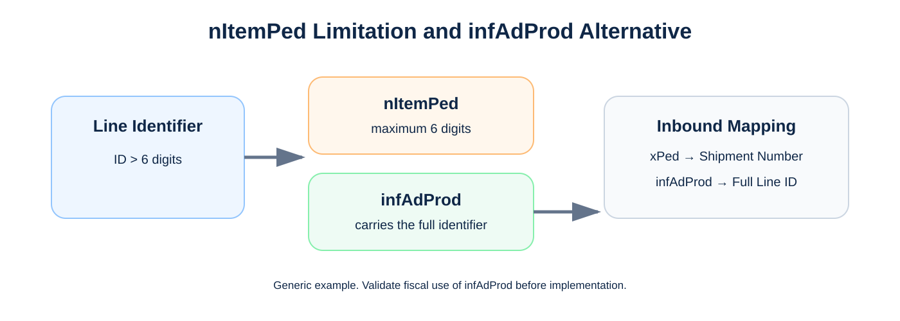
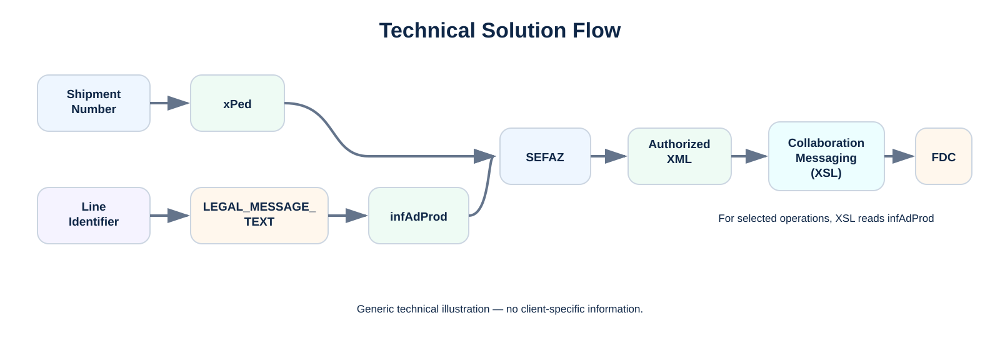

# Oracle Cloud: Working Around the nItemPed Limit in Internal Transfers

I want to share a technical scenario that can appear in Oracle Cloud internal-transfer implementations and one possible way to handle it.

The scenario is common. Goods move from one unit to another and, depending on the operation, an NF-e must be issued.

In an architecture that uses a fiscal partner, Oracle can generate the fiscal document through FDG, send the data to the fiscal partner, the partner transmits it to SEFAZ, and after authorization the NF-e XML becomes available.

When the goods arrive, the XML returns to Oracle, Collaboration Messaging transforms it, and FDC processes the fiscal document.



## Where the limitation appears

For FDC to identify the transfer correctly, the NF-e must be related to the shipment and to the corresponding shipment line.

One possible design is:

```xml
<xPed>Shipment Number</xPed>
<nItemPed>Shipment Line Identifier</nItemPed>
```

The difficulty appears when the technical line identifier is larger than the size supported by `nItemPed`.

In the NF-e layout, `nItemPed` accepts up to 6 digits. In implementations where the technical identifier already exceeds that size, the complete value no longer fits.

Truncating the identifier is not a good option because different identifiers can eventually produce the same shortened value.



## An alternative: infAdProd

One option is to use:

```xml
<infAdProd>
```

This field can carry a larger value and therefore can transport the full line identifier.

The idea becomes:

```text
xPed      → Shipment Number
nItemPed  → remains within the NF-e layout limitation
infAdProd → full shipment line identifier
```

This is an implementation choice. It does not mean that SEFAZ or Oracle defines `infAdProd` specifically for carrying an Oracle technical identifier. The use should be validated with the fiscal team and the fiscal partner.

## Step 1: carry the identifier into the XML

FDG supports `LEGAL_MESSAGE_TEXT` at line level.

Depending on the automation version or design, the Data Model may need to be extended so this attribute can be populated automatically during fiscal document generation.

A generic rule for `TRANSFER ORDER SHIPMENT` can retrieve the line identifier from `ZX_LINES_DET_FACTORS`:

```sql
CASE
    WHEN H.EVENT_CLASS_CODE = 'TRANSFER ORDER SHIPMENT'
    THEN TO_CHAR(
           (
             SELECT NVL(LINK_TO_TRX_LINE_ID, TRX_LINE_ID)
               FROM ZX_LINES_DET_FACTORS
              WHERE TRX_ID           = L.TRX_ID
                AND TRX_LINE_ID      = L.TRX_LINE_ID
                AND APPLICATION_ID   = L.APPLICATION_ID
                AND ENTITY_CODE      = L.ENTITY_CODE
                AND EVENT_CLASS_CODE = L.EVENT_CLASS_CODE
           )
         )
    ELSE L1E_1.LEGAL_MESSAGE_TEXT
END AS LEGAL_MESSAGE_TEXT
```

For this type of transfer, the full identifier can then be made available to the fiscal partner.

The fiscal partner can map the value to:

```xml
<infAdProd>...</infAdProd>
```

## Step 2: make FDC read infAdProd

After the NF-e is authorized and the XML returns to Oracle, the inbound mapping needs to be adjusted so that, for the required operations, the line identifier is read from `infAdProd` instead of `nItemPed`.

In Oracle Cloud:

```text
Tools
  → Collaboration Messaging
    → Manage Collaboration Message Definitions
```

The message definition used for inbound NF-e processing points to an XSL responsible for the transformation.

The default behavior can be similar to:

```xml
<n9:SourceDocumentLine>
    <xsl:value-of select="ns3:prod/ns3:nItemPed"/>
</n9:SourceDocumentLine>
```

For selected operations, the XSL can redirect the value to `infAdProd`.

Generic example:

```xml
<n9:SourceDocumentLine>
    <xsl:choose>
        <xsl:when test="
            (ns3:prod/ns3:CFOP = 6151 or
             ns3:prod/ns3:CFOP = 5151 or
             ns3:prod/ns3:CFOP = 6557 or
             ns3:prod/ns3:CFOP = 5557)
             and normalize-space(ns3:infAdProd) != ''">
            <xsl:value-of select="ns3:infAdProd"/>
        </xsl:when>
        <xsl:otherwise>
            <xsl:value-of select="ns3:prod/ns3:nItemPed"/>
        </xsl:otherwise>
    </xsl:choose>
</n9:SourceDocumentLine>
```

The CFOP values above are only a technical example of how to structure the condition. Each implementation should validate which codes actually belong to its fiscal scenario.



## A few implementation notes

Avoid changing a seeded Collaboration Messaging definition directly. A safer approach is to use a custom definition and keep the standard XSL as the reference.

It is also useful to restrict the rule to the required operations and keep an `otherwise` using `nItemPed`. This reduces the risk of affecting other inbound NF-e flows.

Before moving the change to production, validate an authorized XML and confirm that `infAdProd` contains exactly the expected identifier.

Finally, `infAdProd` is a fiscal field in the NF-e. In this scenario it is used as part of a technical workaround for the size limitation of `nItemPed`, so fiscal validation remains important.

## Public references

- Oracle Fusion Cloud — Fiscal Document Capture  
  https://docs.oracle.com/en/cloud/saas/supply-chain-and-manufacturing/
- Oracle Fusion Cloud — Collaboration Messaging Framework  
  https://docs.oracle.com/en/cloud/saas/supply-chain-and-manufacturing/
- Oracle Fusion Cloud — ZX_LINES_DET_FACTORS  
  https://docs.oracle.com/en/cloud/saas/financials/
- Brazil NF-e Portal  
  https://www.nfe.fazenda.gov.br/
